<h1>Presentación del proyecto</h1>
<h2>Flor de Té</h2>

For de Té es un proyecto de e-commerce del ámbito de herboristería, centrado en el deleite de los sentidos y la relajación, para los amantes de las infusiones y tisanas, hecho por un grupo de coders comprometidos con el medio ambiente.

En For de Té, aspiramos a ser un referente en la creación de experiencias únicas alrededor del té y el café, ofreciendo productos de la más alta calidad que conecten a las personas con los sabores auténticos de todo el mundo.

 Nuestra misión es simple: proporcionar una experiencia incomparable en cada taza. For de Té, creemos que el té y el café son mucho más que bebidas; son momentos de conexión, inspiración y calma. 

Nos dedicamos a ofrecer lo mejor en cada aspecto de nuestra tienda, cuidando cada detalle y compromiso:

    <ul>
        <li><ins>El cliente</ins> es el centro de todo lo que hacemos. Ofrecemos una atención cálida y personalizada, asegurándonos de que cada visita a nuestra tienda sea especial y satisfactoria. </li>
        <li><ins>Cada producto</ins> que ofrecemos está cuidadosamente seleccionado para garantizar frescura, sabor y excelencia.</li>
        <li><ins>Nuestro compromiso</ins> con el medio ambiente nos lleva a buscar el mejor producto del mercado ecológico, garantizamos que es 100% orgánico, cruelty free, de comercio justo y sin microplásticos.</li>
        <li><ins>Innovación</ins> es sinónimo de disfrute, así que buscamos constantemente nuevas formas de sorprender a nuestros clientes, combinando tradición con exotismo, salud con creatividad, sutileza y deleite.</li>
    </ul>

En Flor De Té, creemos que el té y el café son mucho más que bebidas: son experiencias que conectan, inspiran y elevan los momentos cotidianos.

<h2>Desarrollo del proyecto</h2>

Se han empleado para este proyecto los lenguajes de programación HTML5, CSS & javaScript, además de prototipado en figma y por su puesto GitHub para el control de versiones.

El diseño ha sido una preocupación fundamental para el buen resultado de nuestra e-commerce y todas las imagenes en él incluidas son de creación y edicióon propia, con programas de diseño gráfico como Gymp e Inkscape y el uso de inteligencias artificiales como Dall-e mini de Crayon y Leonardo.Ai para obtener fuentes de isnpiración y bocetos rápidos de lo que pretendíamos hacer

     
<h3>Estructura del sitio</h3>

Nuestra primera intuición nos ha llevado a hacer una web con la menor cantidad de páginas posible, con el fin de evitar el laberinto de enlaces y pestañas en que estas suelen convertirse. Finalmente la web Flor de Té consta de:

<h4>Una página de inicio</h4>

Una cabecera que te acompaña por todo el sitio, con con un navegador integrado y su propio buscador, totalmente funcional y desplegable.

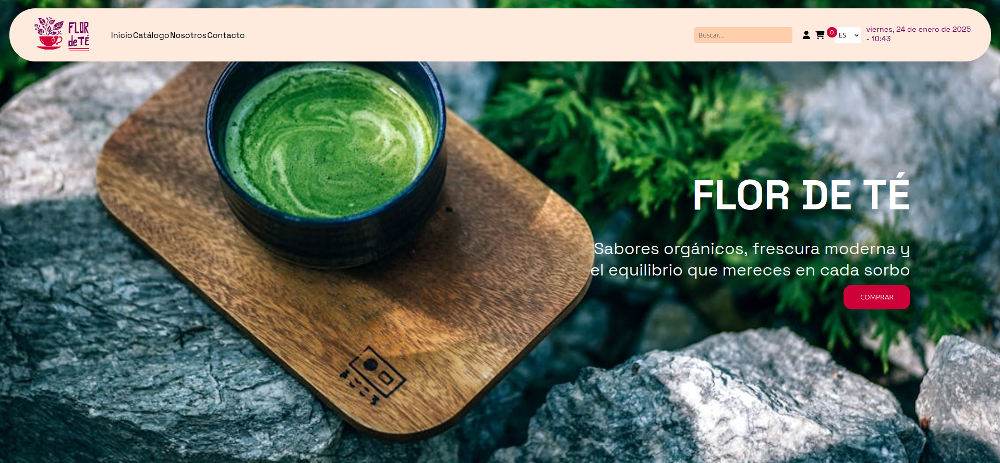

Más abajo de la misma, una selección de los productos mejor valorados por nuestros custommers

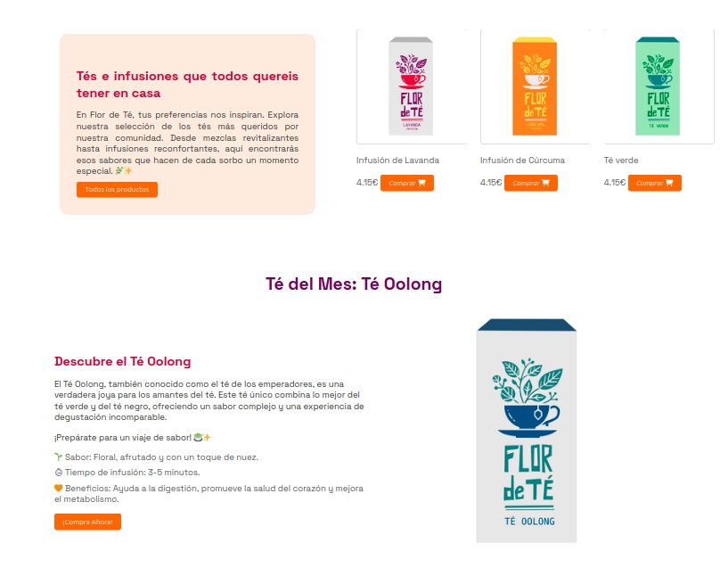

Y por ultimo una sección a promociones, otros artículos y testimonios

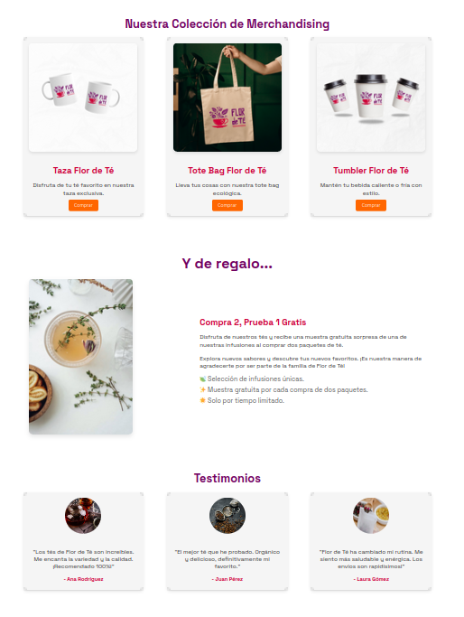

<h4>El catálogo</h4>

Una página que recopila todos nuestros productos y se pueden filtrar por preferencias del usuario, que añade una página de detalle del producto

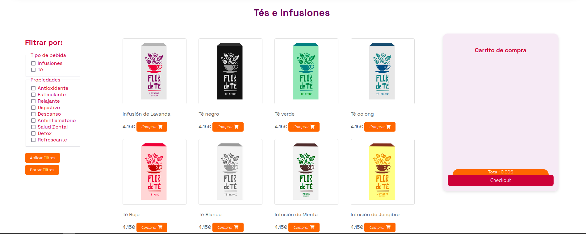

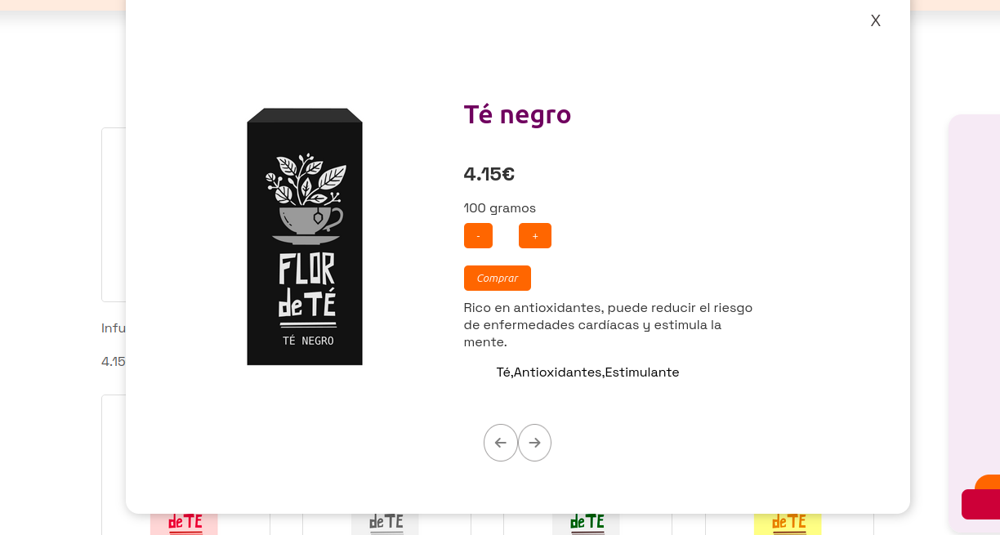

Y claro está una página de checkout donde el cliente puede dar sus datos de dirección y pago y registrar su pedido

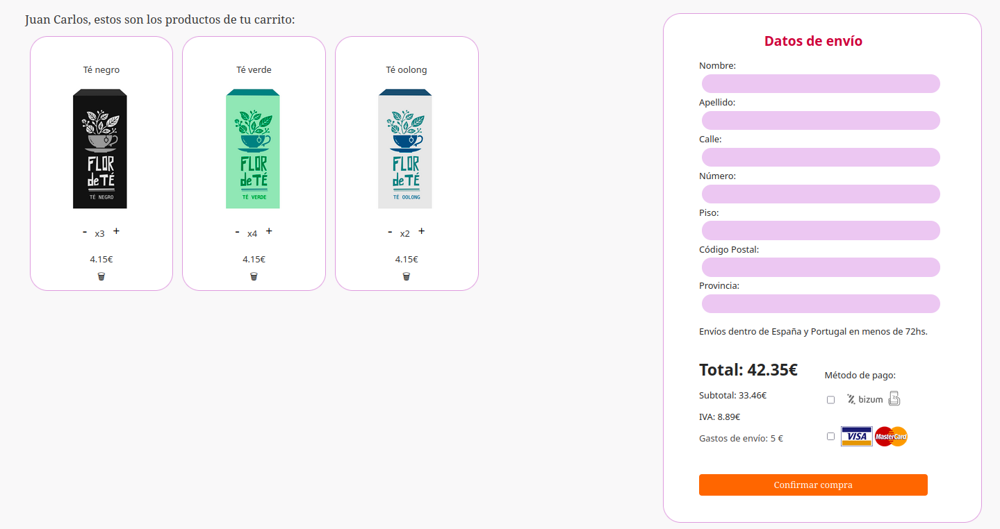

<h4>Nosotros</h4>

Es una página donde el dueño del dominio puede presentarse al público, traemos una primera vista de cómo se podría ver, qué información y fotos podría aportar

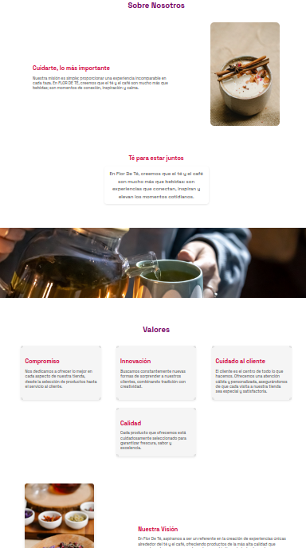

<h4>Contacto</h4>

Una página simple pero eficiente, te proporcionará un contacto con el cliente excelente para recibir sugerencias, buenas críticas y ofrecer soporte virtual

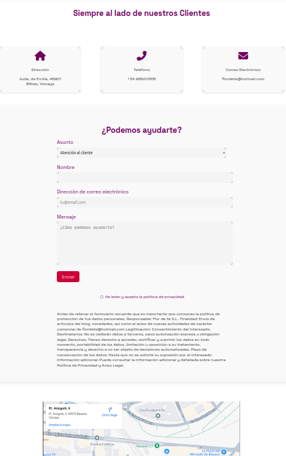

<h4>Login</h4>

Junto con contacto y en el nav, una página de login para fidelizar clientes y una cuenta admin que te permitirá editar personalmente tu tienda y los productos que en ella ofreces

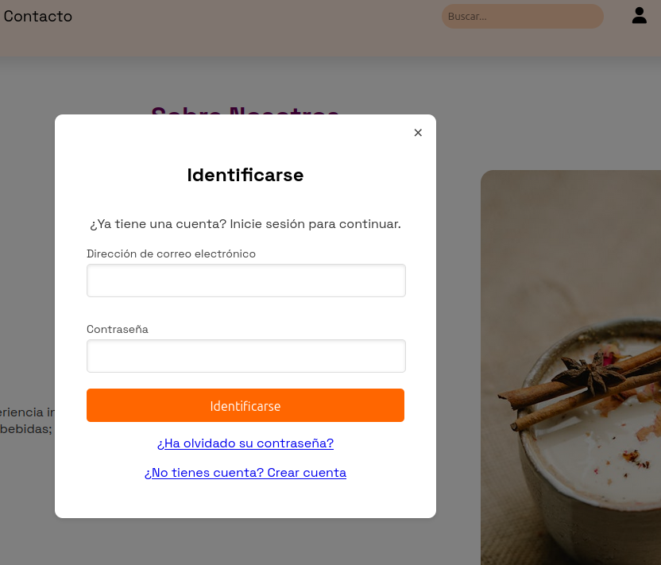

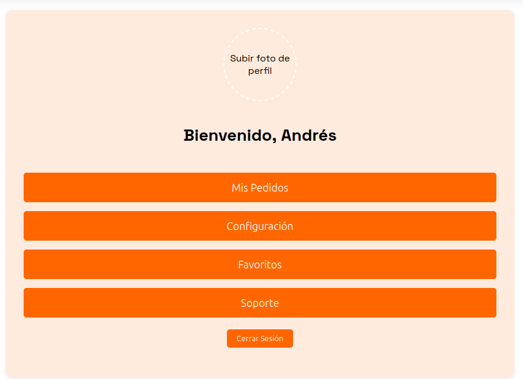

O si eres el admin una página para administrar los productos de tu tienda y leer los mensajes de los usuarios

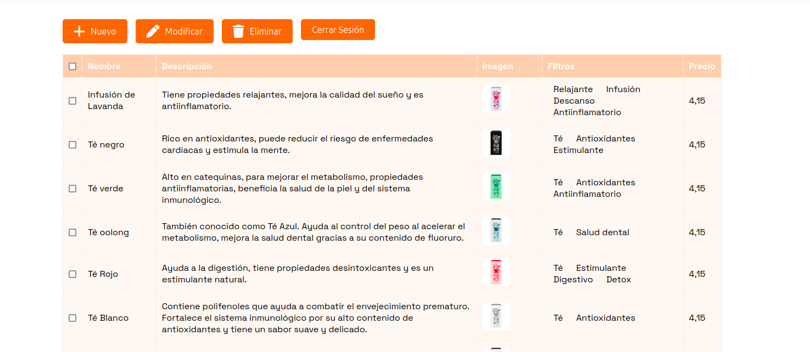
     
<h2>Quién mantiene y contribuye al proyecto</h2>

Este proyecto está mantenido por el equpido Ecoders que ofrece soporte web y el dueño del dominio particular que lo adquiriese encargdo de alimentar con información de primera mano y las peticiones de actualización, tanto de mejora como de nuevas funcionalidades

ECOders está formado por un equipo de desarrolladores web FullStack:
 

| EQUIPO | FUNCIONES | DESARROLLO |
|---------------------------------------|----------------------------------------|------------------------------|
|  | Alejandro: Product Owner | Programador Jr. encargado de la selección de productos, el carrito, el buscador y el Readme. |
|  | Carla: Git Manager | Programadora Jr. Repsonsble del login y la página de contacto, así como de la intranet. |
|  | Lucia: Diseñadora | Programadora Jr. Encargada del diseño del packagin y el logo de la página, la página del catálogo y la página del checkout.|
|  | Maham: Scrum Master | Programadora Jr. encargada de la página nosotros, el menú responsive y selección de fotos.|
|  | Thais:  | Programadora Jr. encargada de la página de inicio, header y footer, estilos y responsive y traducción al Inglés y Euskera |

El sitio cumple con los requisitos de la RGPD en vigor y cuenta con una página donde se describen los derechos de los usuarios con respecto a los datos que facilitan a Flor de Té.

</body>
</html>
