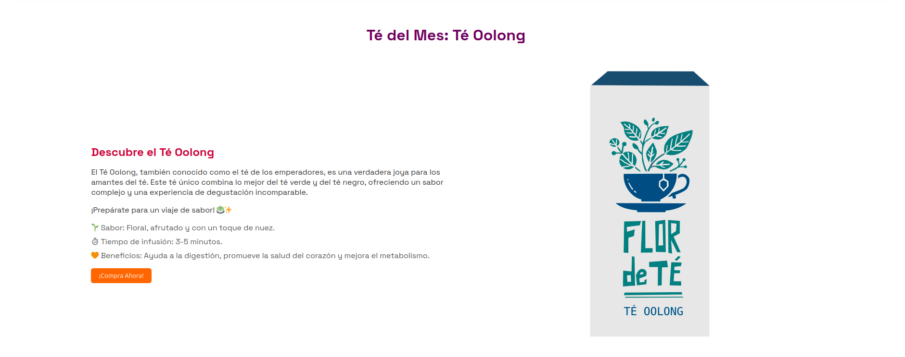
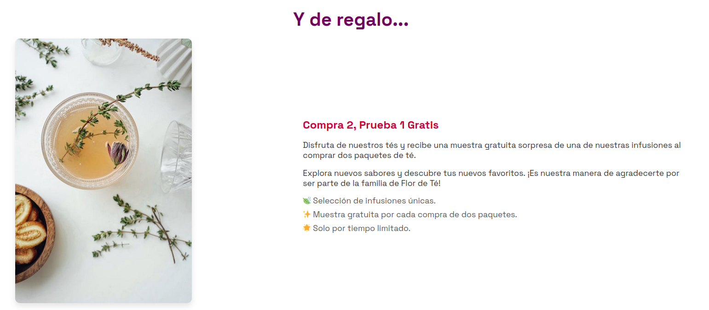
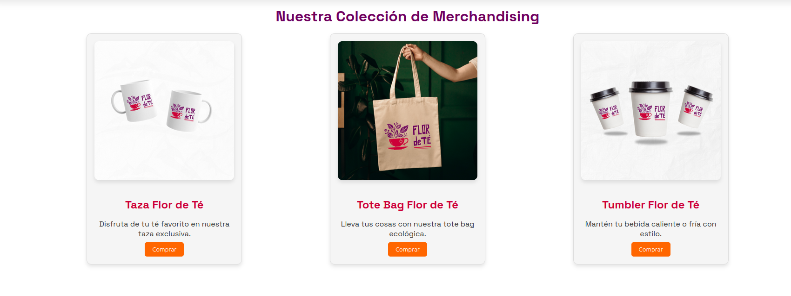
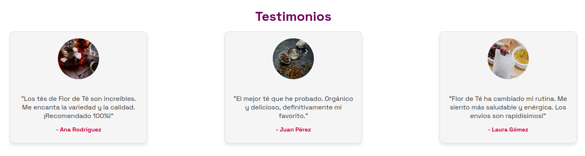

<h1>Presentación del proyecto</h1>
<h2>Flor de Té</h2>

For de Té es un proyecto de e-commerce del ámbito de herboristería, centrado en el deleite de los sentidos y la relajación, para los amantes de las infusiones y tisanas, hecho por un grupo de coders comprometidos con el medio ambiente.

En For de Té, aspiramos a ser un referente en la creación de experiencias únicas alrededor del té y el café, ofreciendo productos de la más alta calidad que conecten a las personas con los sabores auténticos de todo el mundo.

 Nuestra misión es simple: proporcionar una experiencia incomparable en cada taza. For de Té, creemos que el té y el café son mucho más que bebidas; son momentos de conexión, inspiración y calma. 

Nos dedicamos a ofrecer lo mejor en cada aspecto de nuestra tienda, cuidando cada detalle y compromiso:

    <ul>
        <li><ins>El cliente</ins> es el centro de todo lo que hacemos. Ofrecemos una atención cálida y personalizada, asegurándonos de que cada visita a nuestra tienda sea especial y satisfactoria. </li>
        <li><ins>Cada producto</ins> que ofrecemos está cuidadosamente seleccionado para garantizar frescura, sabor y excelencia.</li>
        <li><ins>Nuestro compromiso</ins> con el medio ambiente nos lleva a buscar el mejor producto del mercado ecológico, garantizamos que es 100% orgánico, cruelty free, de comercio justo y sin microplásticos.</li>
        <li><ins>Innovación</ins> es sinónimo de disfrute, así que buscamos constantemente nuevas formas de sorprender a nuestros clientes, combinando tradición con exotismo, salud con creatividad, sutileza y deleite.</li>
    </ul>

En Flor De Té, creemos que el té y el café son mucho más que bebidas: son experiencias que conectan, inspiran y elevan los momentos cotidianos.

<h1>Desarrollo del proyecto</h1>

Se han empleado para este proyecto los lenguajes de programación HTML5, CSS & javaScript, además de prototipado en figma y por su puesto GitHub para el control de versiones.

El diseño ha sido una preocupación fundamental para el buen resultado de nuestra e-commerce y todas las imagenes en él incluidas son de creación y edicióon propia, con programas de diseño gráfico como Gymp e Inkscape y el uso de inteligencias artificiales como Dall-e mini de Crayon y Leonardo.Ai para obtener fuentes de isnpiración y bocetos rápidos de lo que pretendíamos hacer

     
<h1>Estructura del sitio</h1>

Nuestra primera intuición nos ha llevado a hacer una web con la menor cantidad de páginas posible, con el fin de evitar el laberinto de enlaces y pestañas en que estas suelen convertirse. Finalmente la web Flor de Té consta de:

Una página de inicio

Más abajo de la misma una selección de los productos mejor valorados por nuestros custommers

Un pequeño apartado para el producto del mes

Y por ultimo una sección a promociones, otros artículos y testimonios

Los socios se han mostrado interesados en manifestar su apoyo por lo que se ha creado una página donde se recogen sus comentarios.

También se cuenta con una página llamada FAQ donde se muestran las preguntas más comunes para una primera resolución de cuestiones. Para mayor información existe el formulario de contacto.

Todas ellas cuentan con un menú responsive formato “hamburguesa” para los tamaños móvil y tablet y completo para el formato desktop.

Una vez que un usuario es dado de alta como socio del club existe la posibilidad de loguearse para ser reconocido como tal y no tener que pagar por las actividades en las que participe aunque sigue siendo necesaria su inscripción a los mismos. Esta parte queda pendiente de un posterior desarrollo que no es objeto de este proyecto y se realizará usando programación en Javascript.

     
<h1>Dónde pueden recibir ayuda los usuarios</h1>

Los usuarios pueden ponerse en contacto con el propio club a través de los canales de comunicación con los que cuenta el club:

    <ul>
        <li>Sede: Calle mayor s/n. 48930-Getxo, Bizkaia</li>
        <li>Teléfono: 944 01 23 45</li>
        <li>Correo electrónico: <a href="mailto:info@oriongetxo.com">info@oriongetxo.com</a></li>
    </ul>

Para cualquier cuestión técnica se pueden poner en contacto con Grupo3 en el email: <a href="mailto:info@grupo3.com">info@grupo3.com</a>

     
<h1>Quién mantiene y contribuye al proyecto</h1>

Este proyecto está mantenido por el propio club Orion Getxo quien se encarga de alimentar con información de primera mano y actualizadas de las propias actividades, noticias del mundo del tiro con arco, etc.

La parte técnica recae en la empresa Grupo3 que asegura el buen funcionamiento de la página web actualizándola con todos aquellos elementos que sean necesarios.

Grupo3 está formado por un equipo especializado en el diseño de páginas web con Html5, Css3 y Javascript. Los integrantes son:

| EQUIPO | FUNCIONES |
|------------------------------------------------|-------------------------------------------------------------------------------------------------------------------------|
|  | Alejandro: Programador senior de Html5 y Css 2-3. Responsable de home, Ham-button, carrusel y elemntos comunes |
|  | Allan: Scrum Master. Programador senior de Html5 y Css 2-3. Repsonsble de noticas |
|  | Azalfa:Programador senior de Html5 y Css 2-3. Responsable de testimonios |
|  | Igor: Product owner. Programador senior de Html5 y Css 2-3. Responsable de formularios y elementos legales |
|  | Najwa: Programador senior de Html5 y Css 2-3. Responsable de actividades y programas |

El sitio cumple con los requisitos de la RGPD en vigor y cuenta con una página donde se describen los derechos de los usuarios con respecto a los datos que facilitan a Orion Getxo.

</body>
</html>
